现在很多好用的服务注册都需要国外的手机号，很多年前免费注册一个 Google Voice 号码就可以解决这个问题，而且还有很多的保号（一段时间没有收发短信和电话后就会被注销）教程，但是现如今，很多服务都已经不支持 Google Voice 了，更多的是不支持类似的虚拟号，所以需要找到一个新的解决方案。

### 检测号码是否为虚拟号

怎么查看号码是虚拟号也很简单，我们通过 [查询地址](https://freecarrierlookup.com/) 输入自己的手机号就可以查看，`Is Wireless` 为 `n` 则代表是虚拟号。

### 套餐和使用要求

Ultra Mobile Paygo 具体的信息这里就不多说了，网上信息非常的多，说一下套餐信息和使用要求

月租 3 美元。每个月免费 100 分钟电话和 100 条短信，收发都算在内，正常使用应该是够用了。充值也比较方便，有信用卡可以直接充值，或者买充值卡充值。

使用的话正常来说国外的卡在国内使用算漫游，但是 Paygo 卡支持 Wifi Calling（Wifi 通话/无线局域网通话），所以在国内使用也是没有问题的，那么你的手机或者备用机得支持 Wifi Calling 功能，不然使用可能会有点麻烦。基本上苹果的手机都支持，安卓的手机就不一定了，需要自己去查看。

### 购买 Ultra Mobile Paygo 卡

国内某东或者某宝都可以购买到，价格大概在 150～200 元不等，购买后需要激活，激活后就可以使用了。国外可以在 eBay 上购买，价格大概在 10～20 美元不等。需要自己转运回国，如果个人使用建议在某东或者某宝购买，方便快捷。

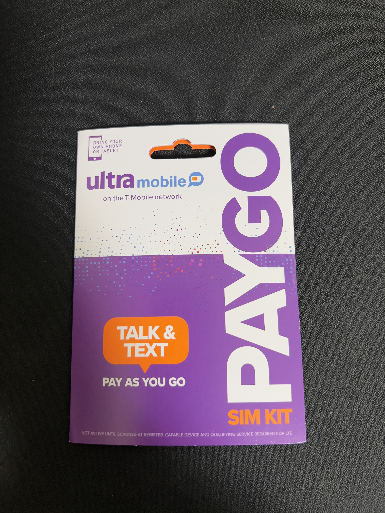

和国内的卡没什么区别，适配大多数的卡槽。

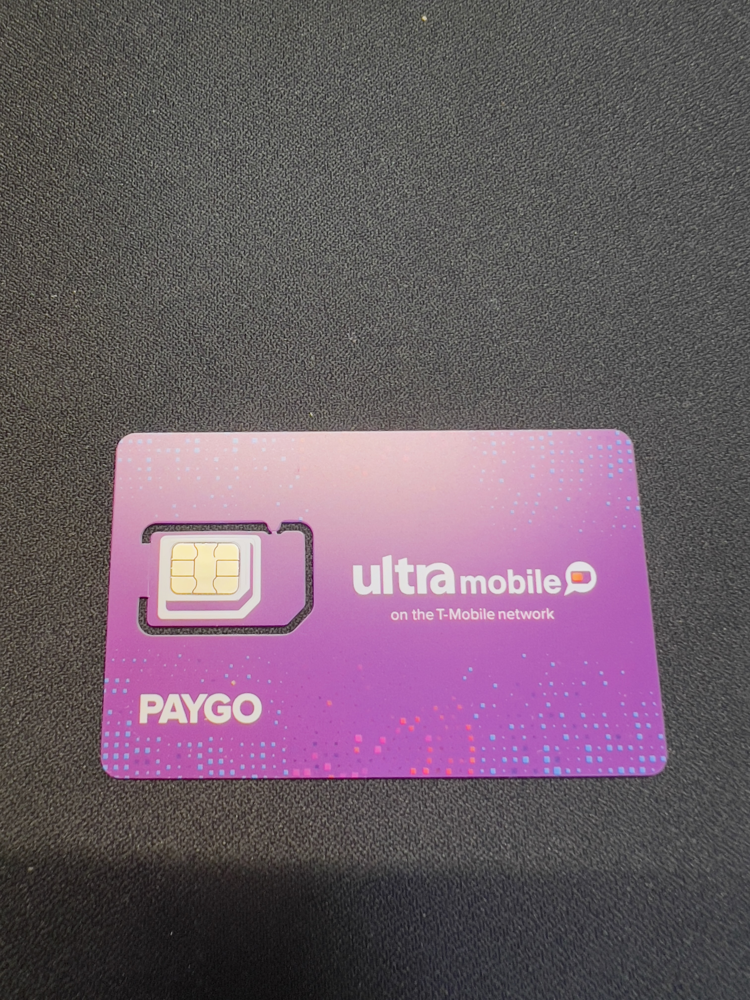

### 激活

打开 [激活地址](https://my.ultramobile.com/paygo/activation/)，输入卡背面的激活码，看不懂英文的没关系，右上角可以切换成中文

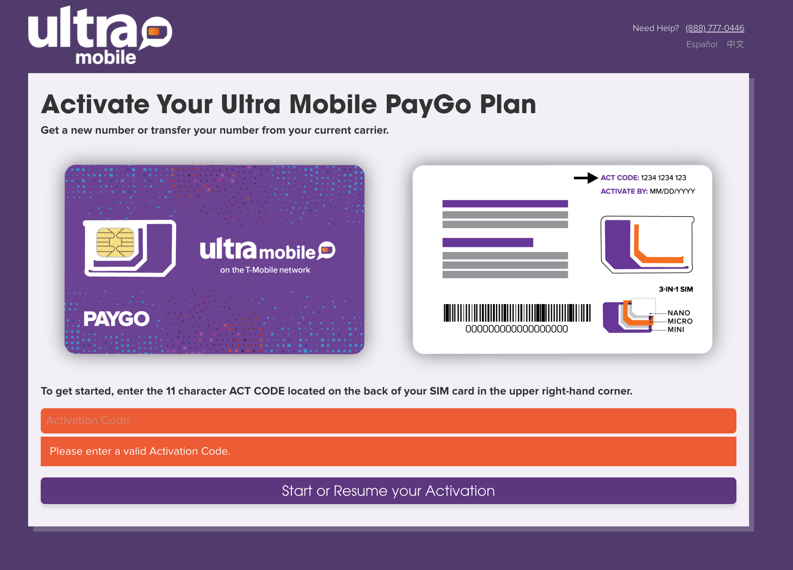

这一步可以不用填写（验证设备是否支持），直接点击下一步
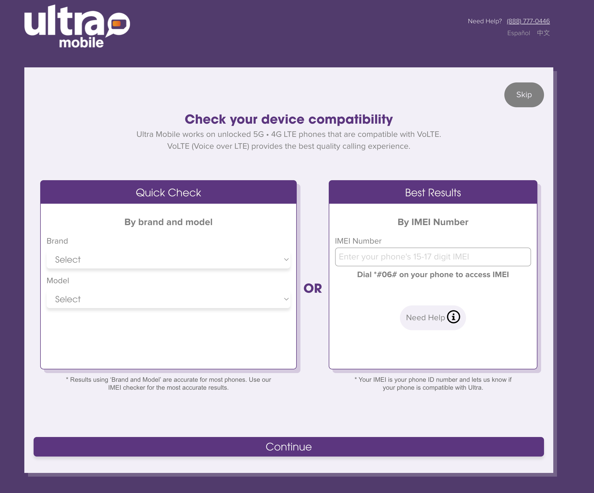

输入激活的地区邮编，可以填写 `90016`，这个是美国加州的邮编，第 4 点选择是激活一个新的号码还是转移号码，如果你是有比较好的虚拟号段可以转移过来，没有就激活一个新的，这一步根据自己的需要谨慎选择，其他的信息不用动。转移的话根据不同的虚拟服务商方式也不一样，需要自己去查看。这里我选择激活新的号码。

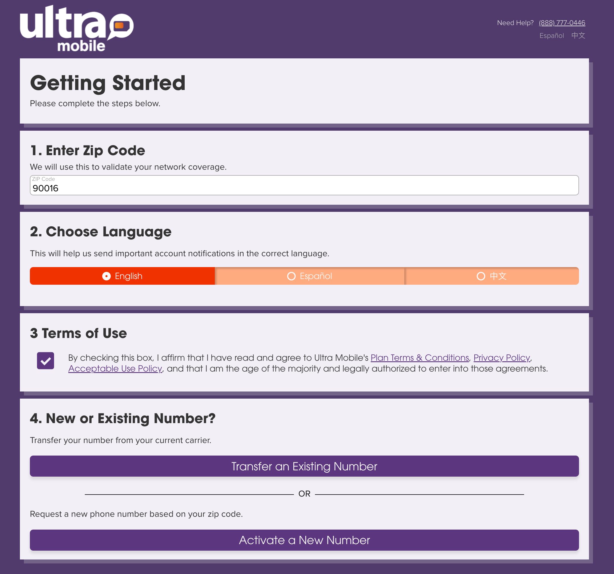

点击激活、下一步，等个几分钟就可以激活成功了（可能会有点长，耐心等待），激活成功后会有一个新的号码，这个号码就是你的 Ultra Mobile Paygo 号码了。
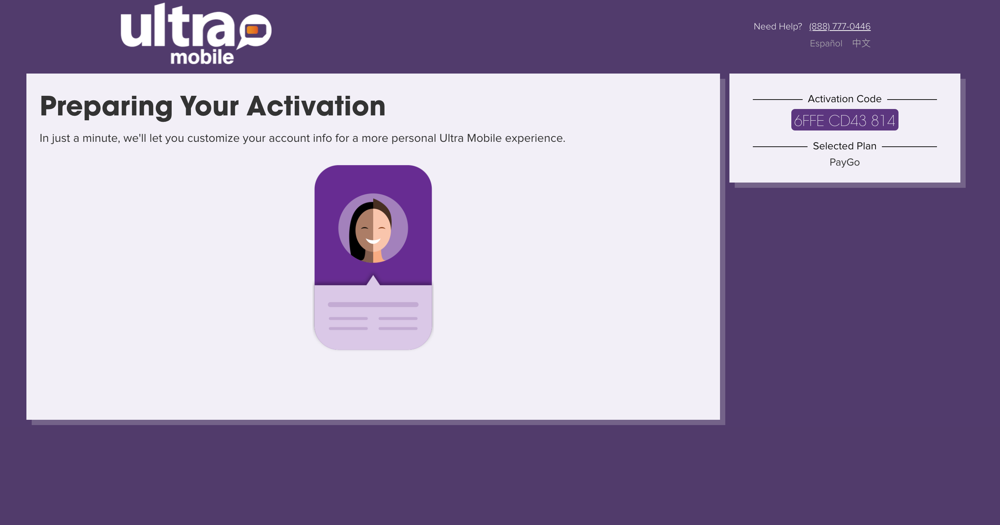

激活成功添加付款信息，这一步可以跳过，后面充值的时候再添加也可以，这里我选择跳过。

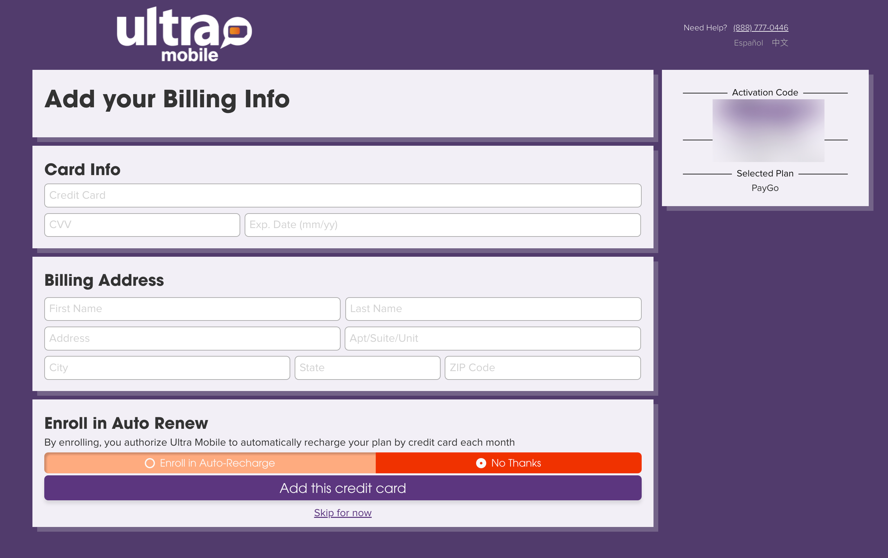

添加账号等信息，这一步也可以跳过，看自己需要，完成后就可以使用了。

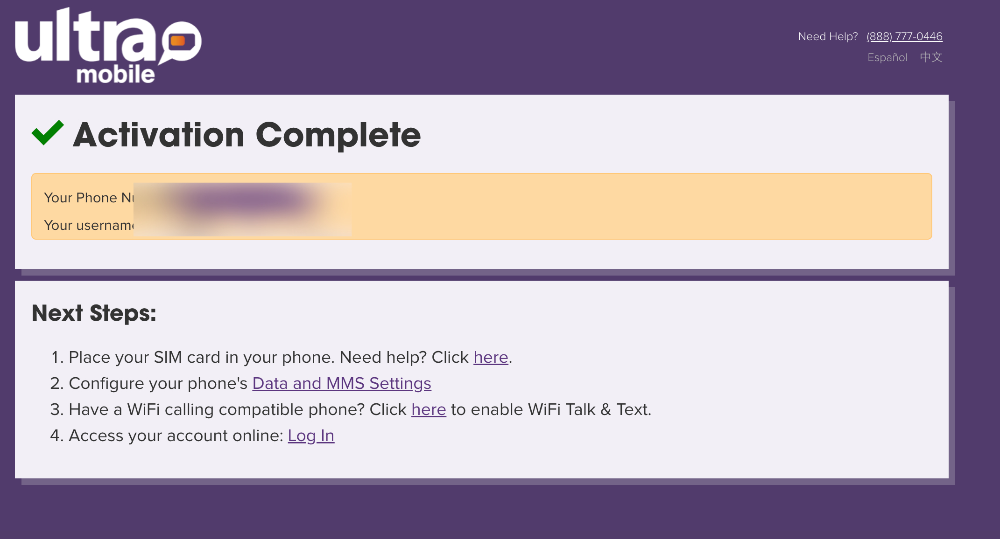

### 手机设置

手机卡插上，等待下信号搜索完成，然后在设置-蜂窝网络-Wifi 通话/无线局域网通话，打开后面的开关，出现填写地址的弹窗后，填入下面的地址后保存返回即可，有时候地址可能会失效，可以自己去 Google 搜索一下，找一个可用的地址即可。这一步是为了激活 Wifi Calling 功能，如果不激活的话，可能会导致无法正常使用。特别注意的是如果 Wifi Calling 功能没有激活，那么你的通话和短信可能会非常的贵，所以一定要等激活完成后再进行其他的操作。

- Adress：200 N Spring Street
- City：Los Angeles
- State：CA
- Zip Code：90012

### 充值和用量查询

上面一切都完成后，收到开通的短信了，短信需要你回复对应的内容激活下（看不懂的可以拍照翻译下），激活后我们在 [管理后台](https://my.ultramobile.com/login) 通过手机号和短信验证码（首次）登陆，后续可以在管理后台设置账号密码登陆，登陆后可以看到自己的套餐信息，充值也可以在这里进行。

点击 `Recharge PayGo Wallet`，进到充值页面，根据自己的需求选择充值卡和信用卡，我选择了信用卡
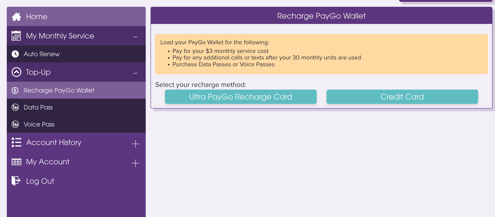

选择对应的充值金额，可以少量充值，我选择 $10，每三个月充值一次就可以，这样就算号码因为某些原因不能用也不会亏损太多

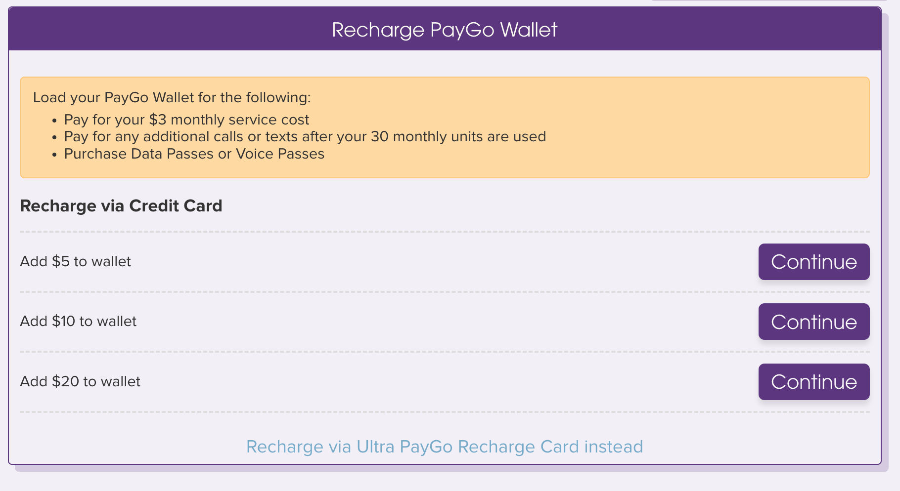

根据自己的情况输入信用卡信息和地址信息，地址这里找个美国免税州的地址，除了必须的一些税费（免税不是全部免，有些还是需要交的），其他的都不用交，我选择了俄亥俄州的地址，其他的州也可以，自己去查一下就可以了

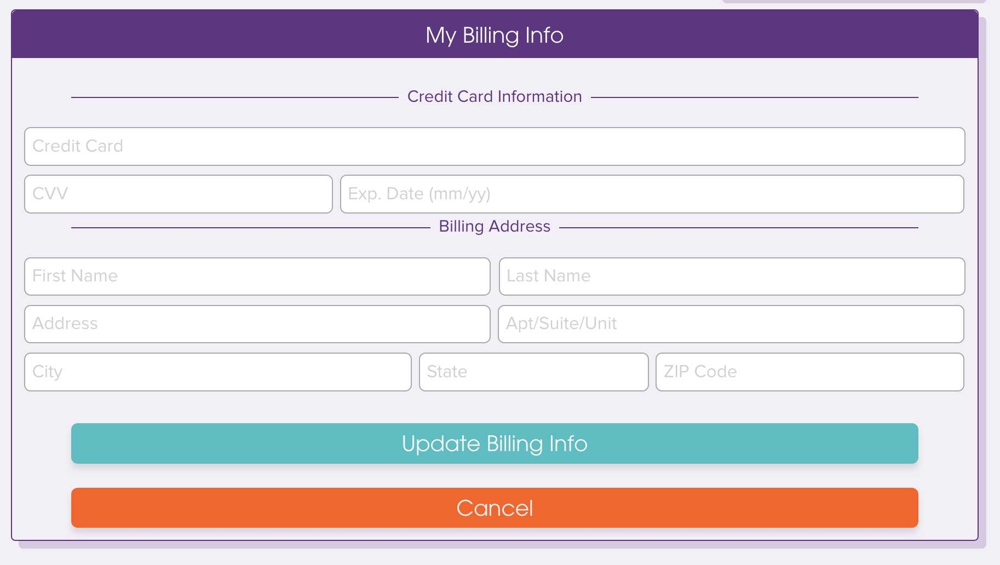

充值完成后，可以在交易记录里面看到充值记录，充值成功后，可以在 `Home` 里面看到余额

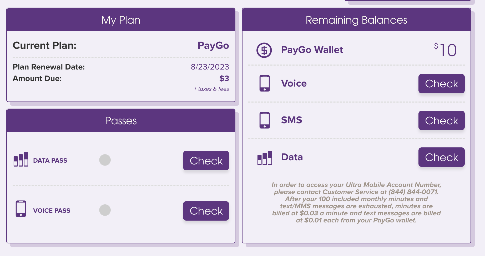

当然了最好是下个 APP 可以随时查看余量

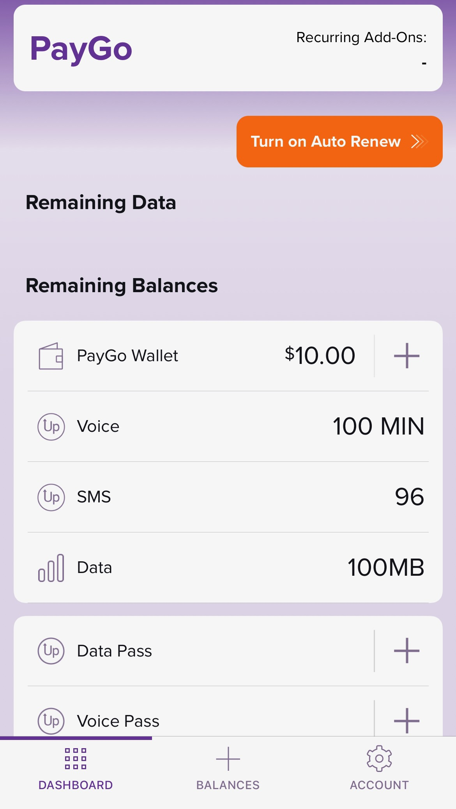

如果是备用机的话，可以备用机登陆你的 iCloud 账号，然后同步下短信，这样平时你的手机放在家里，你的主力机也是可以收到短信的，非常的方便。
