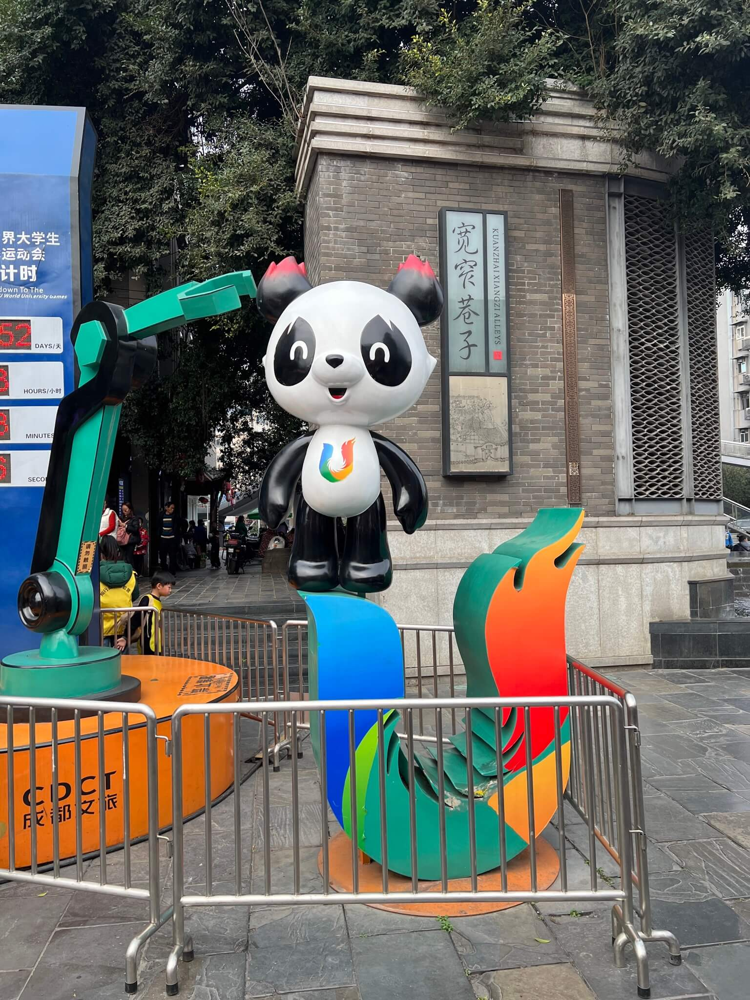

前几天同事说社会工龄十年可以申请十天年假，找了找回忆发现自己应该也工作十年多了，遂翻了下最早的社保缴纳记录是 13 年的 12 月份，到今天真真正正已经工作十年了。

## 工作

意料之外今年职级晋升了，我对于晋升其实没有太多的感觉，可能因为我是非科班出身，对于晋升、向上管理并不感冒，晋升答辩时我的表现并不是很好，工作以来第一次参加职级晋升，大部分晋升的同事都是小组长这种，我是少数的大头兵之一，所以很多思考的问题我更多是关于技术而不是大方向，大部分工作有个人的努力但是都离不开团队的支持，我在的团队整体氛围很好，幸运的是我呆过的大多数公司所在团队氛围都还行，那种整天不说话只会埋头苦干的团队空气都能凝结成冰，我喜欢的是大家一起讨论，一起解决问题，一起进步，一起成长的团队。

今年团队也陆陆续续的走了一些熟悉的同事，大部分的同事在公司满三年了，每到三年都是一个节点，行业竞争加剧，整体经济下行，公司的业务也在不断的调整，主动或被动的离开都是一种选择。

## 健康

近些年腰部明显感觉力量不够，比如搬重的物品后腰会酸痛，长时间走路后腰也会酸痛，这个问题需要解决，我想了想，可能是因为我长期坐姿不正确，习惯性的二郎腿导致腰和脊椎有变形，所以现在会可以的改变坐姿，尽量不要二郎腿，尽量保持直腰，尽量保持脊椎挺直，这个问题需要长期的改变才能有所改善。

## 旅游

### 衢州

过年的时候去了趟衢州，不算很热门的旅游城市，大过年的时候很多店铺都关门了，逛了逛街走马观花，吃了吃当地的小吃，感觉还行，不过没有什么特别的印象。

### 成都

2 月底的时候消费了一下快要结束的年假，去了趟成都，刚下飞机就去吃了冷锅串串，味道挺不错的

杜甫草堂，景色不错

成都美术馆

宽窄巷子，商业步行街，人很多，没必要特意来逛

大熊猫基地，进门就去了缆车排队，证明是个明智的选择，地方蛮大的其实，幸运的是看到了不少的大熊猫

以及给小猫猫买的礼物

当然还有必不可少的火锅

### 上海

4 月份的时候父母来上海玩，我在上海工作了 7 8年但是游玩的地方很少，去的最多的地方除了居住周边也就是外滩了，这次和女朋友一起带着父母逛了逛上海

看了看城隍庙和豫园，去了海洋馆，登上了东方明珠，总体来说体验不错，父母也很开心

## 演唱会

### 扬州光影音乐节

### 南京李健演唱会

### 上海李健演唱会

## 总结

今年总的来说比去年忙碌了很多，但是也有很多收获，希望明年能够更好的生活。
